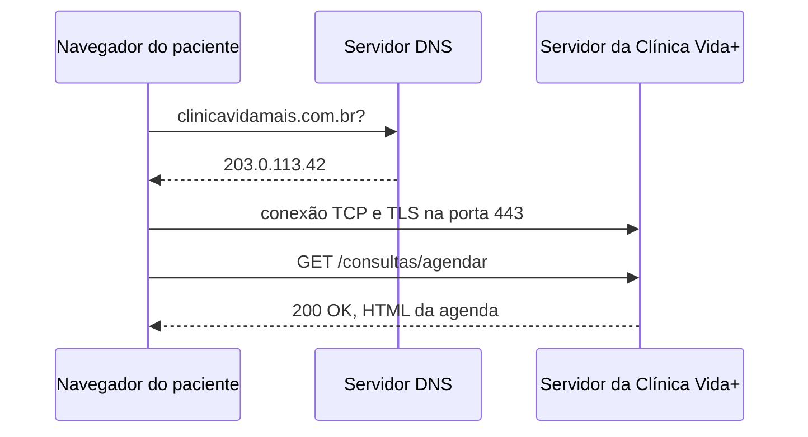

## Evidência do DNS

```
186.251.39.123
```
| Recurso | Método | Status |
|---|---|---|
| www.uninove.br | GET | 200 |
| gtm.js | GET | 304 |
| index.497f13d13.css | GET | 200 |
| x-icon.png | GET | 200 |
